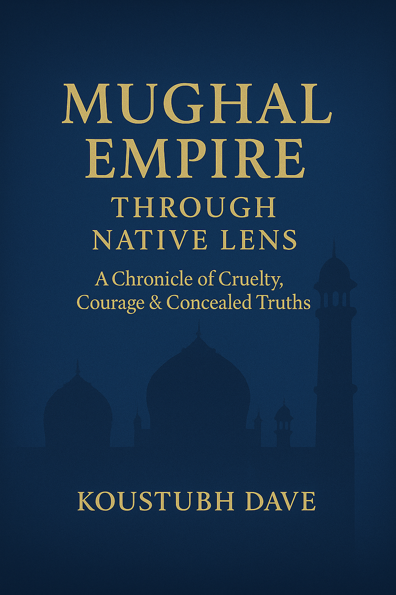

# 🏛️ Mughal Empire Truth Handout | Exposing NCERT Lies | Hindu Resistance History

> **Unmask the Mughal Empire. Break free from NCERT distortions. Reclaim Bharat’s dharmic past.**

---

## 📘 Project Overview

**Mughal Empire: A Chronicle of Cruelty, Courage & Concealed Truths** is a truth-based, decolonized historical handout that exposes the brutality of the Mughal Empire, the temple destruction campaigns, the persecution of Brahmins, and the systematic cultural genocide erased from modern Indian textbooks like NCERT.

This dharmic document revives forgotten facts:  
- The burning of Nalanda and Takshashila  
- The reality of Akbar’s Meena Bazaar and Jauhar  
- The tyranny of Aurangzeb in Kashi and Mathura  
- The untold valor of Hindu kings, saints, and scholars

This project is **not just history** — it’s **civilizational restoration**.

---

## 🧠 Why This Project Exists

In modern India, students are taught that the Mughal rulers were “great administrators and patrons of art.”  
But they are never told about:
- **Babur's destruction of Ayodhya’s temples**
- **Aurangzeb’s orders to demolish Kashi Vishwanath**
- **The 6-month-long burning of Nalanda by Bakhtiyar Khilji**
- **The spiritual and martial resistance by Brahmins, Bhakti saints, and Rajput warriors**

This handout challenges the mainstream, Marxist-whitewashed narrative.

> 🔥 This is a tool of **memory warfare** — forged not in academia, but in anguish.

---

## 🗂️ Contents at a Glance

| Page | Title | Theme |
|------|-------|-------|
| 0 | Flames Before the Fall | Takshashila and Nalanda – the first cultural genocide |
| 1 | The Mask of History | NCERT’s glorification of Mughal tyrants |
| 2 | Babur | Butcher of Hindustan, destroyer of Ayodhya |
| 3 | Akbar | The masked monarch who weaponized marriage and Meena Bazaar |
| 4 | Jahangir & Shah Jahan | Aesthetics and atrocities in royal courts |
| 5 | Aurangzeb | Tyrant of temples, slayer of saints and kin |
| 6 | Hindu Resistance | From Mewar to Malwa — swords, saints, and survival |
| 7 | Dharma of Resistance | Strategy, sacrifice, and civilizational fire |
| 8 | Cultural Genocide | Shastras lost, gurus silenced, temples erased |
| 9 | Conclusion | Breaking the chains of fake history |
| 10 | Glossary | Kavitas, chaupais, native dharmic terms |
| 11 | References | Eye-witnesses, granthas, native historians |

---

## 📥 Download the Full Project

📄 **[Download the Full PDF Handout](https://yourusername.github.io/mughal-empire-truth-handout/Mughal_Truth_Project.pdf)**  
🌐 **[Read on GitHub Pages (Live Website)](https://yourusername.github.io/mughal-empire-truth-handout/)**

---

## 💬 Reader Feedback & Suggestions

📝 **[Submit a Review or Suggestion](https://yourusername.github.io/mughal-empire-truth-handout/#reader-feedback)**  
🤝 **Want to contribute? Translate? Cite? Reach out.**

---

## 🔗 Connect with the Author

👤 [Koustubh Dave – LinkedIn](https://www.linkedin.com/in/koustubh-dave-0690131a1)  
📩 Available for discussion, citation requests, and dharmic collaborations.

---

## 🔎 SEO Keywords

> Mughal Empire Truth, NCERT Lies, Hindu Resistance, Brahmin Scholars, Cultural Genocide India, Meena Bazaar Reality, Babur Butcher of Hindustan, Aurangzeb Temple Destruction, Nalanda Burning, Takshashila University, Real Indian History, Sanatan Dharma, Native Historians of Bharat, Temple Destruction History, Decolonized Indian History, Akbar Whitewash, Hindu Pride History, Kashi Vishwanath Demolition

---

## 🏷 GitHub Topics (for discoverability)

> Add these topics to your repo settings:  
history, mughal-empire, hindu-history, dharmic-history, real-indian-history, ncert-lies, bharat, cultural-genocide, temple-history, akbar-exposed, aurangzeb

---

## 📚 License & Usage

This handout is offered for:
- **Educational use**
- **Awareness campaigns**
- **Community distribution**

> You may quote, remix, cite, or translate with attribution.

---

## 📌 Citation Example

> Dave, Koustubh. *Mughal Empire: A Chronicle of Cruelty, Courage & Concealed Truths*. GitHub, 2025.  
> [https://github.com/yourusername/mughal-empire-truth-handout](https://github.com/yourusername/mughal-empire-truth-handout)

---

## 🧭 Roadmap (Optional)

- [ ] Hindi & Sanskrit translations  
- [ ] Infographic companion version  
- [ ] Research-backed timeline tool  
- [ ] Real-time interactive testimonials section  

---

> **"Civilizations do not die in war. They die in forgetfulness."**  
> This project is an act of remembrance.

---

## 🔗 Quick Links

- 📥 [Download Full PDF](https://yourusername.github.io/mughal-empire-truth-handout/Mughal_Truth_Project.pdf)  
- 🌐 [View Website](https://yourusername.github.io/mughal-empire-truth-handout/)  
- 💬 [Submit Feedback](https://yourusername.github.io/mughal-empire-truth-handout/#reader-feedback)  
- 🔗 [LinkedIn – Koustubh Dave](https://www.linkedin.com/in/koustubh-dave-0690131a1)

---

